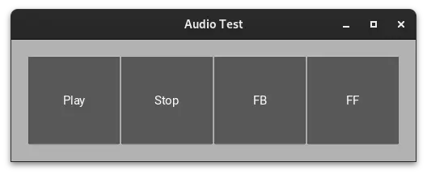

# pyt_kivy_sound_play

<br>

## 内容 

Kivyで音楽を再生するプログラムです。プログラムと同じフォルダに保存したmp3ファイル(ファイル名’test.mp3′)を操作します。



<br>

### 前準備

　以下のコマンドを実行すると、kivyに必要なビデオ、オーディオについてのバックエンドをインストールします。

pip install kivy[media]

### 音楽ファイルを操作する方法

#### 音楽ファイルの読み込み

　音楽ファイルの読み込みには、クラスkivy.core.audio.SoundLoaderのLosd()イベントを使用して以下のようにおこないます。

```
from kivy.core.audio import SoundLoader

        # Audioファイルの読み込み
        self.sound = SoundLoader.load('test.mp3')
```

#### 音楽ファイルの再生

　音楽ファイルの再生はplay()によりおこないます。以下では、Playボタンが押された時に、①self.soundが定義されていることと②状態(self.sound.state)がstopであることを確認して、そうであったなら、再生位置をseek()により指定してから音楽ファイルを再生しています。

```
    # 再生ボタンの処理
    def on_play_press(self):
        if self.sound and self.sound.state == 'stop':
            self.sound.seek(self.time)
            self.sound.play()
```

#### 音楽ファイルの停止

　音楽ファイルの停止はstop()によりおこないます。以下では、状態が’play’の場合に、get_pos()により再生位置を取得して、再生を停止しています。
　※　取得した再生位置は、音楽ファイルの再生時に使用します。

```
    # 停止ボタンの処理
    def on_stop_press(self):
        if self.sound.state == 'play':
            self.time = self.sound.get_pos()
            self.sound.stop()
```

#### 音楽ファイルの再生位置を変更する

　音楽ファイルの再生位置の変更は、①変更後の再生位置を算出して、②その再生位置に移動したのち再をおこなうことで実現します。

　変更後の再生位置の算出は、get_pos()により取得した現在の再生位置に移動したい量を加えることでおこないます（単位：秒）。そして、計算した位置にseek()により移動して、play()により再生をおこなうことで再生位置への移動がおこなえます。

```
    # 巻き戻しボタンの処理（10秒戻る）
    def on_feedb_press(self):
        if self.sound.state == 'play':
            self.time = self.sound.get_pos() - 10
            self.sound.seek(self.time)
            self.sound.play()
```
<br>


### kivy.core.audio.Soundのイベント

| イベント | 内容 |
| --- | --- |
| Play()  | ファイルを再生する。 |
| stop() | ファイルの再生を停止する。 | 
| unload() | メモリからファイルデータを解放する。 |　　
| seek(position)　 | 指定したposition（秒で指示）に移動する。<br>ほとんどのサウンドプロバイダーは、オーディオが停止するとシークできない。再生中にシークする。 |
| get_pos()	 | オーディオファイルの現在の位置を返す。停止中は、0を返す。 |

### kivy.core.audio.Soundのプロパティ

| プロパティ | 内容	| 値 |
| --- | --- | --- |
| source | オーディオファイルの名前 | StringProperty<br>既定値: None、<br>読み取り専用 |
| state	| サウンドの状態<br>（’stop’もしくは’play’） | OptionProperty<br>読み取り専用 |
| loop |  サウンド終了時の対応<br>True: 自動的にループ | BooleanProperty<br>既定値: False |
| pitch	| 音のピッチ（0.5 – 2）<br>SDL2 オーディオ プロバイダーに対してのみ実装 | NumericProperty<br>既定値: 1 |
| volume | 音量（範囲: 0-1）1が最大音量、0がミュート | NumericProperty<br>既定値: 1 |

## 参考にしたHP
